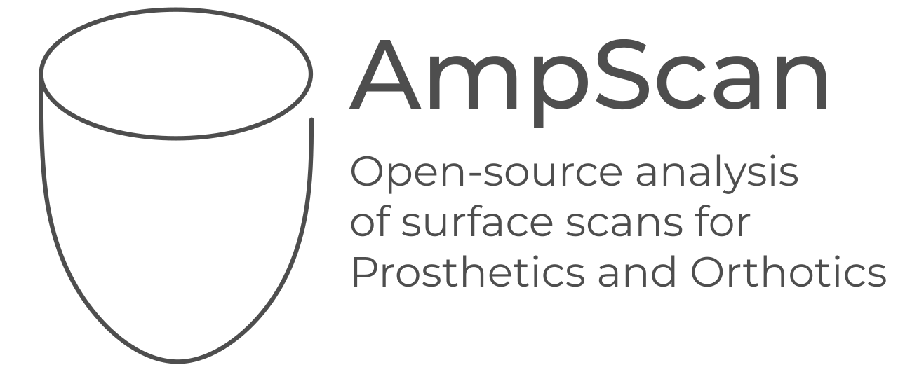

**Join chat:** 
**Build status:** 
**Docs:** 
**License:** 
**DOI:** 

ampscan is an open-source Python package for analysis and visualisation of digitised surface scan data, specifically for applications within Prosthetics and Orthotics, developed with the ABEL at the University of Southampton. These industries are increasingly using surface scanners as part of clinical practice to capture the patient's individual geometry to design personalised devices. ampscan gives researchers within this field access to powerful tools to analyse the collected scans to help inform clinical practice towards improved patient-outcomes. This package has been designed to be accessible for researchers and clinicians with only a limited knowledge of Python. Therefore, analysis procedures can all be accessed using the lightweight Graphical User Interface within the git repo, and will soon be available as a standalone [web-app](https://github.com/abel-research/ampscan_webapp).

The typical ampscan process is demonstrated above (Figure 1) and the core functionality summarised below, with a more detailed description available in the online [documentation](https://ampscan.readthedocs.io/en/latest/):

- **[AmpObject](https://ampscan.readthedocs.io/en/latest/source/core.html)**: this is the key object of the package and holds the key data and methods. The key data held within the AmpObject is the mesh data including arrays of the vertices, faces, normals and field values. The vtk actor for visualisation is also stored. The [core](https://ampscan.readthedocs.io/en/latest/source/core.html) methods of the AmpObject include imports for .stl files, saving .stl files, rotation and translation. Further methods on the core AmpObject include [smoothing](https://ampscan.readthedocs.io/en/latest/source/smooth.html), [trimming](https://ampscan.readthedocs.io/en/latest/source/trim.html) and [visualisation](https://ampscan.readthedocs.io/en/latest/source/ampVis.html). 

- **[Alignment](https://ampscan.readthedocs.io/en/latest/source/align.html)**: This takes two AmpObjects, one fixed and one moving, and applies a rigid transformation to the moving AmpObject in order to minimise the spatial error between the two AmpObjects. This means that when the registration process is performed, only the true shape deviations are calculated.  

- **[Registration](https://ampscan.readthedocs.io/en/latest/source/registration.html)**: This takes two AmpObjects, one baseline and one target, and applies a non-rigid transformation to morph the baseline vertices onto the surface of the target. Following this, a detailed map of the spatial difference between the two shapes can be visualised and analysed. 

- **[Analysis](https://ampscan.readthedocs.io/en/latest/source/analyse.html)**: This is used to extract key geometrical infomation about the shape, including volume and serial slice cross section areas and perimeters. 

- **[Graphical User Interface](../master/gui/ampscanGUI.py)**: This enables visualisation to multiple AmpObjects within a single window, giving access to the automated and manual alignment tools as well as registration. This facilitates the core analysis of the scan data for users who are not experienced Python users. The python version of the GUI is available in the [gui](https://github.com/abel-research/ampscan/tree/master/gui) folder from the git repo and a standalone [webapp](https://github.com/abel-research/ampscan_webapp) will soon be avilable. 

Potential applications of ampscan include tracking how the limb shape and volume has changed over time, digitising manual prosthetic socket design modifications, and comparing the outputs of different scanning technologies. 

ampscan relies heavily on [NumPy](http://www.numpy.org/) and [SciPy](https://www.scipy.org/) to perform mathematical operations with visualisation handled by [PyQt](https://riverbankcomputing.com/software/pyqt/intro) and [VTK](https://www.vtk.org/). The package is still under development by researchers at the University of Southampton. For full documentation, visit the [ampscan website](https://ampscan.readthedocs.io/en/latest/).

Installing ampscan
-------------------

ampscan has a number of dependencies, namely; NumPy, SciPy, Matplotlib, PyQt and vtk. We recommend using 
conda to deal with these. Before installation, ensure your environment is using Python 3. 

Install dependencies using conda:

``conda install numpy scipy pyqt matplotlib vtk==8.1.0``

For the most up to date version of ampscan, clone directly from the github repository using:

``git clone https://github.com/abel-research/ampscan``

Navigate to the `ampscan/` directory and run a pip install using:

``pip install -e .``

ampscan will soon be available on pip once v0.3 is released 

If you are installing on Red Hat, you may need to install the dependencies listed in the [Yum Requirements file](yum_requirements.txt).

Maintainer Notes
----------------

If you wish to help develop ampscan, then please read our [contributing guidelines](CONTRIBUTING.md).

Documentation for the ampscan library is automatically generated using 
[sphinx](http://www.sphinx-doc.org/en/master/). Any additional code should be documented in 
accordance with 'numpy style' docstrings. A template can be found 
[here](https://www.numpy.org/devdocs/docs/howto_document.html#example).

Testing
-------

Testing is performed automatically using [Travis Ci](https://travis-ci.org/abel-research/ampscan). New tests can be added to the repo. 

License
--------

At ampscan we use the MIT license, which can be found here [here](../master/LICENSE)

How to acknowledge
------------------

ampscan is currently under review at JOSS, check the progress [here](https://github.com/openjournals/joss-reviews/issues/2060)
