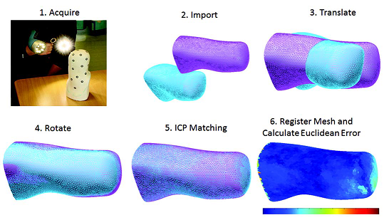

# Summary

The increasing accessibility of surface scanners is giving users the ability to accurately digitise the 3D surface geometry of real world objects which may then be manufactured by CNC machining or 3D printing. In addition to hobbyist applications, these devices are being increasingly used within prosthetics and orthotics clinics to capture the patients' individual geometry. These scans are imported into computer-aided design packages to generate patient-specific medical devices, such as prosthetic sockets, spinal braces or ankle-foot orthoses. This increasing digitsiation of patient data provides great potential for analysis in order to inform and improve clinical practice. While this has been an area of academic interest for several decades, clinical use is minimal. One of the reasons for this is the lack of tools available for clinicians to analyse the geometry of their patient datasets. 

Building on foundational work published by Zachariah, Sorenson and Sanders [@Sanders: 2005], in a previously published paper [@Dickinson:2016] we detailed a method for comparing pairs of surface scans using alignment, registration and visualisation, and extracting key measurements for evaluation of the accuracy and reliability of clinically-used scanners. Further studies have also demonstrated using this package for comparing the consistency of casting techniques [@Dickinson: APOSM], statistical shape modeling across the population [@Steer: BMMB] and quantifying rectifications between the residual limb and the prosthetic socket [@Steer: AOPA]. 

This method was written in MATLAB, however, this was considered restrictive for other researchers to access as they may not possess a MATLAB license.  In order to maximise access to the developed techniques and improve performance, especially for 3D visualisation, the methods were rewritten from scratch within Python, including updated algorithms for each stage of the aforementioned process. 

The ampscan package has been designed with a range of user groups in mind, from practicing clinicians to biomedical engineering researchers, with an appreciation that they may not have an extensive background in coding. To this aim, the software has been developed in Python and leverages the commonly used libraries of NumPy, SciPy, matplotlib, vtk and pyqt. As such, full functionality of the software can be accessed without requiring additional installs. The core analysis of the package can be carried out both within a script-based environment, or alternatively with the supplied lightweight GUI [@Steer: ISPO].  

The core functionality of ampscan is summarised below with a more detailed description available in the online [documentation](https://ampscan.readthedocs.io/en/latest/):
- **[AmpObject](https://ampscan.readthedocs.io/en/latest/source/core.html)**: this is the key object of the package and holds the key data and methods. The key data held within the AmpObject is the mesh data including arrays of the vertices, faces, normals and field values. The vtk actor for visualisation is also stored. The [core](https://ampscan.readthedocs.io/en/latest/source/core.html) methods of the AmpObject include imports for .stl files, saving .stl files, rotation and translation. Further methods on the core AmpObject include [smoothing](https://ampscan.readthedocs.io/en/latest/source/smooth.html), [trimming](https://ampscan.readthedocs.io/en/latest/source/trim.html) and [visualisation](https://ampscan.readthedocs.io/en/latest/source/ampVis.html). 
- **[Alignment](https://ampscan.readthedocs.io/en/latest/source/align.html)**: This takes two AmpObjects, one fixed and one moving, and applies a rigid transformation to the moving AmpObject in order to minimise the spatial error between the two AmpObjects. This is performed through an Iterative Closest Point (ICP) algorithm.
- **[Registration](https://ampscan.readthedocs.io/en/latest/source/registration.html)**: This takes two AmpObjects, one baseline and one target, and applies a non-rigid transformation to morph the baseline vertices onto the surface of the target. This is performed by a point-to-plane method. The registered shape ends up with the same number of vertices and connectivity as the baseline, thereby enabling shape comparison.
- **[Analysis](https://ampscan.readthedocs.io/en/latest/source/analyse.html)**: This is used to extract key geometrical infomation about the shape, including volume and serial slice cross section areas and perimeters.
- **Graphical User Interface**: This enables visualisation to multiple AmpObjects within a single window, giving access to the automated and manual alignment tools as well as registration. This facilitates the core analysis of the scan data for users who are not experienced Python users. 

Other packages perform the specific tasks of ampscan more comprehensively such as [mayavi](https://docs.enthought.com/mayavi/mayavi/index.html) for scientific data visualisation, [open3d](http://www.open3d.org/docs/getting_started.html) for alignment and registration techniques, and [gibbon](https://www.gibboncode.org/) for integration with finite element modelling. At this time, the package only contains limited mesh fixing tools that may be required for erroneous scans. Until such methods are implemented, the authors recommend [meshlab](http://www.meshlab.net/) which also contains methods for alignment and visualisation. An ampscan web-app is currently in development to further increase accessibility of these tools for clinicians and researchers working across the growing field of bespoke digital medical device design, and enable them to perform standardised, accessible and reliable analysis, and enhance patient experience.

# Acknowledgments 
While the ampscan package was not funded directly, the authors would like to thank the following for their financial support:
- JWS: the University of Southampton’s EPSRC Doctoral Training Program (ref EP/M508147/1) and EUROSTARS project (ref 9396)
- PRW: the EPSRC-NIHR “Medical Device and Vulnerable Skin Network” (ref EP/M000303/1),
- ASD: the Royal Academy of Engineering, UK, (ref RF/130).

# References
